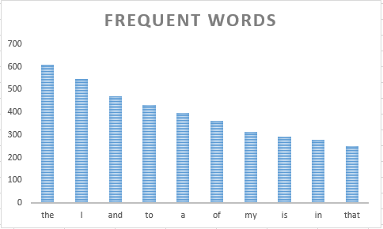

# big-data-project

## Steps to create RDD's and processing data through Spark and performing word count operation.

### Step 1: Creating a Resilient Distributed Datasets

Resilient distributed datasets can be created in two ways.

1. By loading an external dataset

   ``` val sampleRDD = sc.textFile("D:/romeo.txt")```

1. By distributing collection of Objects

   ```val sampleRDD = sc.parallelize(List["red" "blue"]```

### Step 2: Breaking each line into words using flatMap

```val sampleWC = sampleRDD.flatMap(line => line.split(" "))```

### Step 3: Map each word to a count using map function and perform aggregation of words using reduceByKey

```val sampleMap = sampleWC.map(word => (word, 1)).reduceByKey((a, b) => a + b)```

### Step 4: Display the contents using collect() function

```sampleMap.collect()```

### Step 5: Performing sorting(sortBy) and obtain the top results using take() method

```var res = sampleMap.sortBy(_._2,false).take(10);```

### Step 6: Transfer results from command prompt to a text file

```
def exportResults(f: java.io.File)(op: java.io.PrintWriter => Unit) {
|   val p = new java.io.PrintWriter(f)
|   try { op(p) } finally { p.close() }
| }
exportResults(new File("D:/example.txt")) { p =>
|   data.foreach(p.println)
| }
```

### Step 7: Transfer the results to an excel file and visualize them.




### Reference

1. Spark data set-up on windows --> https://github.com/denisecase/setup-spark

1. Creating and Managing RDD ---> https://spark.apache.org/docs/latest/rdd-programming-guide.html

1. File handling ---> https://stackoverflow.com/questions/4604237/how-to-write-to-a-file-in-scala
````
